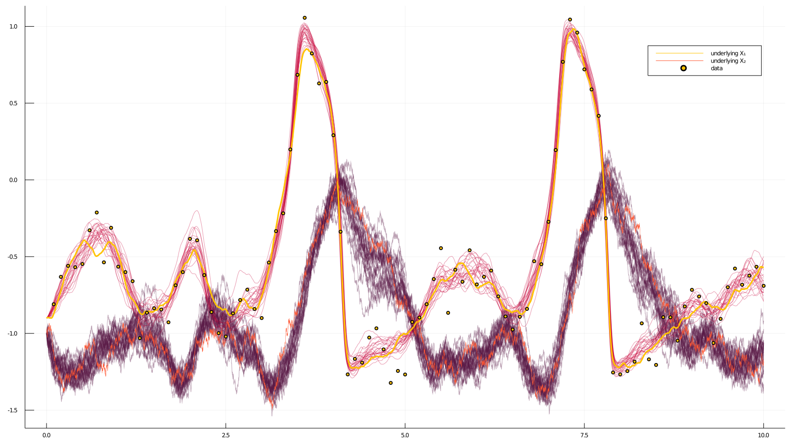

# [How to do blocking?](@id how_to_do_blocking)
****
**Blocking** is a technique that modifies smoothing algorithms and facilitates more efficient exploration of the path space. A path is updated in blocks instead of being imputed in full. Blocking and the preconditioned Crank-Nicolson scheme both aim to achieve the same goal, but the two approaches differ in execution.

```julia
# Perform smoothing for the data in the `recording`, using Guided Proposals with
# the auxiliary law `AuxLaw` and using a blocking technique based on three
# artificial observations.
function simple_smoothing_with_blocking(
        AuxLaw, recording, dt;
        ρ=0.5, num_steps=10^4, AuxLawBlocking=AuxLaw, artificial_noise=1e-6
    )
    # -------------------------------------------------------------------------#
    #                          Initializations                                 #
    # -------------------------------------------------------------------------#
    # time-grids for the forward-simulation of trajectories                    #
    # we pass a time-transformation for improved accuracy                      #
    tts = OBS.setup_time_grids(recording, dt, standard_guid_prop_time_transf)  #
    # memory parameters for the preconditioned Crank-Nicolson scheme           #
    ρρ = [ρ for _ in tts]                                                      #
    # laws of guided proposals (without any blocking)                          #
    PP = build_guid_prop(AuxLaw, recording, tts)                               #
                                                                               #
    # starting point                                                           #
    # NOTE `rand` for `KnownStartingPt` simply returns the starting position   #
    y1 = rand(recording.x0_prior)                                              #
    # initialize the `accepted` trajectory                                     #
    XX, WW, Wnr = rand(PP, y1)                                                 #
    # initialize the containers for the `proposal` trajectory                  #
    XX°, WW° = trajectory(PP)                                                  #
                                                                               #
    paths = []                                                                 #
    num_accpt = 0                                                              #
    # -------------------------------------------------------------------------#


    #--------------------------------------------------------------------------#
    #                          Blocking setup                                  #
    #--------------------------------------------------------------------------#
    # let's do some very simple blocking based on three points                 #
                                                                               #
    # place three ~equidistant points                                          #
    num_intv = length(PP)                                                      #
    one_quarter_pt = div(num_intv, 4)                                          #
    one_half_pt = div(num_intv, 2)                                             #
    three_quarter_pt = one_half_pt + one_quarter_pt                            #
                                                                               #
    # define helper functions to build views to the relevant sections          #
    # of PP, XX, etc. corresponding to different blocks                        #
    block_set_1_builder(x, offset=0) = [                                       #
        view(x, 1:(one_half_pt-offset)),                                       #
        view(x, (one_half_pt+1):length(x))                                     #
    ]                                                                          #
    block_set_2_builder(x, offset=0) = [                                       #
        view(x, 1:(one_quarter_pt-offset)),                                    #
        view(x, (one_quarter_pt+1):(three_quarter_pt-offset)),                 #
        view(x, (three_quarter_pt+1):length(x))                                #
    ]                                                                          #
    make_block_set(f) = (                                                      #
        PP = f(PP, 1),                                                         #
        XX = f(XX),                                                            #
        XX° = f(XX°),                                                          #
        WW = f(WW),                                                            #
        WW° = f(WW°),                                                          #
        ρρ = f(ρρ),                                                            #
    )                                                                          #
                                                                               #
    # define two sets of blocks                                                #
    B1 = make_block_set(block_set_1_builder)                                   #
    B2 = make_block_set(block_set_2_builder)                                   #
                                                                               #
    # define guided proposals on the last interval of each block               #
    artif_PP1 = [                                                              #
        guid_prop_for_blocking(B1.PP[1][end], AuxLawBlocking, artificial_noise)#
    ]                                                                          #
    artif_PP2 = collect([                                                      #
        guid_prop_for_blocking(B2.PP[i][end], AuxLawBlocking, artificial_noise)#
        for i in 1:2                                                           #
    ])                                                                         #
                                                                               #
    num_accpt = [[0,0], [0,0,0]]                                               #
    lls = [[0.0, 0.0], [0.0, 0.0, 0.0]]                                        #
    #--------------------------------------------------------------------------#

    # MCMC
    for i in 1:num_steps
        #  -----------------------
        #  | imputation on SET 1 |
        #  -----------------------
        # set an auxiliary point
        set_obs!(artif_PP1[1], B1.XX[1][end].x[end])
        # the guiding term must be recomputed...
        recompute_guiding_term!(B1.PP[1], artif_PP1[1])
        recompute_guiding_term!(B1.PP[2])

        # find a Wiener path W reconstructing the trajectory X
        for j in 1:2
            for k in 1:length(B1.PP[j])
                DD.invsolve!(B1.XX[j][k], B1.WW[j][k], B1.PP[j][k])
            end
            # on block 1 the last guided proposal is removed from B1.PP[1]
            # and instead the artif_PP1[1] must be used
            j==1 && DD.invsolve!(B1.XX[j][end], B1.WW[j][end], artif_PP1[1])
        end

        y = y1
        # impute the path
        for j in 1:2 # there are two blocks in the first set

            # sample a path on a given block
            _, ll° = rand!(
                B1.PP[j], B1.XX°[j], B1.WW°[j], B1.WW[j], B1.ρρ[j], Val(:ll), y;
                Wnr=Wnr
            )

            # on the first block sample the last segment using a different law
            if (j==1)
                y = B1.XX°[j][end-1].x[end]
                _, ll°_last = rand!(
                    artif_PP1[1], B1.XX°[j][end], B1.WW°[j][end], B1.WW[j][end],
                    B1.ρρ[j][end], Val(:ll), y; Wnr=Wnr
                )
                ll° += ll°_last
            end

            # compute log-likelihood on this interval for the accepted path
            ll = loglikhd(B1.PP[j], B1.XX[j])
            if (j==1) # on the first block the last segment has a different law
                ll += loglikhd(artif_PP1[1], B1.XX[j][end])
            end

            lls[1][j] = ll # save for printing
            if rand() < exp(ll°-ll)
                for k in eachindex(B1.XX[j])
                    B1.XX[j][k], B1.XX°[j][k] = B1.XX°[j][k], B1.XX[j][k]
                    B1.WW[j][k], B1.WW°[j][k] = B1.WW°[j][k], B1.WW[j][k]
                end
                num_accpt[1][j] += 1
                lls[1][j] = ll°
            end
            y = B1.XX[j][end].x[end]
        end


        #  -----------------------
        #  | imputation on SET 2 |
        #  -----------------------
        # set auxiliary points
        for j in 1:2
            set_obs!(artif_PP2[j], B2.XX[j][end].x[end])
            recompute_guiding_term!(B2.PP[j], artif_PP2[j])
        end
        # B2.PP[3] does not need to be recomputed, but of course, can be for
        # good measure
        # recompute_guiding_term!(B2.PP[3])

        # find a Wiener path W reconstructing the trajectory X
        for j in 1:3
            for k in 1:length(B2.PP[j])
                DD.invsolve!(B2.XX[j][k], B2.WW[j][k], B2.PP[j][k])
            end
            j<3 && DD.invsolve!(B2.XX[j][end], B2.WW[j][end], artif_PP2[j])
        end

        y = y1
        # impute the path
        for j in 1:3 # there are three blocks in the second set

            # sample a path on a given block
            _, ll° = rand!(
                B2.PP[j], B2.XX°[j], B2.WW°[j], B2.WW[j], B2.ρρ[j], Val(:ll), y;
                Wnr=Wnr
            )

            # on the 1st & 2nd block sample the last segment with a different law
            if (j<3)
                y = B2.XX°[j][end-1].x[end]
                _, ll°_last = rand!(
                    artif_PP2[j], B2.XX°[j][end], B2.WW°[j][end], B2.WW[j][end],
                    B2.ρρ[j][end], Val(:ll), y; Wnr=Wnr
                )
                ll° += ll°_last
            end

            # compute log-likelihood on this interval for the accepted path
            ll = loglikhd(B2.PP[j], B2.XX[j])
            if (j<3) # on the 1st & 2nd block the last segment has a different law
                ll += loglikhd(artif_PP2[j], B2.XX[j][end])
            end

            lls[2][j] = ll
            if rand() < exp(ll°-ll)
                for k in eachindex(B2.XX[j])
                    B2.XX[j][k], B2.XX°[j][k] = B2.XX°[j][k], B2.XX[j][k]
                    B2.WW[j][k], B2.WW°[j][k] = B2.WW°[j][k], B2.WW[j][k]
                end
                num_accpt[2][j] += 1
                lls[2][j] = ll°
            end
            y = B2.XX[j][end].x[end]
        end


        # progress message
        if i % 100 == 0
            println(
                "$i. ",
                "ll₁₁=$(lls[1][1]) (ar₁₁=$(num_accpt[1][1]/100)), ",
                "ll₁₂=$(lls[1][2]) (ar₁₂=$(num_accpt[1][2]/100));  ",
                "ll₂₁=$(lls[2][1]) (ar₂₁=$(num_accpt[2][1]/100)), ",
                "ll₂₂=$(lls[2][2]) (ar₂₂=$(num_accpt[2][2]/100)), ",
                "ll₂₃=$(lls[2][3]) (ar₂₃=$(num_accpt[2][3]/100))"
            )
            num_accpt[1] .= 0
            num_accpt[2] .= 0
        end

        # save intermediate path for plotting
        i % 400 == 0 && append!(paths, [deepcopy(XX)])
    end
    paths
end
```

### Example
We can apply the routine above to the example used also in [the previous how-to-guide on smoothing](@ref how_to_smoothing). Before doing so however, we must additionally override the behaviour of `nonhypo` and `nonhypo_σ` functions from the package [DiffusionDefinition.jl](https://github.com/JuliaDiffusionBayes/DiffusionDefinition.jl).
```julia
@inline DD.nonhypo(x, P::FitzHughNagumo) = x[SVector{1,Int64}(2)]
@inline DD.nonhypo_σ(t::Float64, x, P::FitzHughNagumo) = SMatrix{1,1,Float64}(P.σ)
```

We are now ready to run the algorithm
```julia
paths = simple_smoothing_with_blocking(
    FitzHughNagumoAux, recording, 0.001; ρ=0.84, num_steps=10^4, artificial_noise=1e-12
)
```

It takes about 50sec on my laptop.
