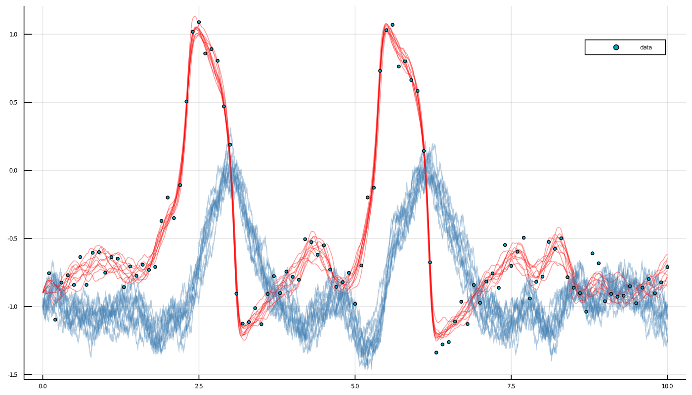

# How to infer diffusion parameters based on its discrete-time observations?
***
The most convenient solution is to use the package [DiffusionMCMC.jl](https://github.com/JuliaDiffusionBayes/DiffusionMCMC.jl). Below, we explain how to do it without this package, using solely [DiffusionDefinition.jl](https://github.com/JuliaDiffusionBayes/DiffusionDefinition.jl), [ObservationSchemes.jl](https://github.com/JuliaDiffusionBayes/ObservationSchemes.jl) and [GuidedProposals.jl](https://github.com/JuliaDiffusionBayes/GuidedProposals.jl).

Define some transition kernel for the parameter updates. We will use a simple random walker

```julia
# define a simple transition kernel
function customkernel(θ, s::Symbol, scale=0.1)
    θ° = deepcopy(θ)
    θ°[s] += 2.0*scale*(rand()-0.5)
    θ°
end
```

The main routine

```julia
# Perform inference on a single parameter for the data in the `recording`, using
# Guided Proposals with the auxiliary law `AuxLaw`.
function simple_inference(AuxLaw, recording, dt, θ; ρ=0.5, num_steps=10^4, ϵ=0.3)
    # -------------------------------------------------------------------------#
    #                          Initializations                                 #
    # -------------------------------------------------------------------------#
    # time-grids for the forward-simulation of trajectories                    #
    tts = OBS.setup_time_grids(recording, dt)                                  #
    # memory parameters for the preconditioned Crank-Nicolson scheme           #
    ρρ = [ρ for _ in tts]                                                      #
    # laws of guided proposals                                                 #
    PP = build_guid_prop(AuxLaw, recording, tts)                               #
    # laws of guided proposals for parameter proposals                         #
    PP° = deepcopy(PP)                                                         #
                                                                               #
    # starting point                                                           #
    # NOTE `rand` for `KnownStartingPt` simply returns the starting position   #
    y1 = rand(recording.x0_prior)                                              #
    # initialize the `accepted` trajectory                                     #
    XX, WW, Wnr = rand(PP, y1)                                                 #
    # initialize the containers for the `proposal` trajectory                  #
    XX°, WW° = trajectory(PP)                                                  #
                                                                               #
    ll = loglikhd(PP, XX)                                                      #
    paths = []                                                                 #
    imp_num_accpt = 0                                                          #
    param_num_accpt = 0                                                        #
    pname = collect(keys(θ))[1]                                                #
    θθ = Float64[θ[pname],]                                                    #
    # -------------------------------------------------------------------------#

    # MCMC
    for i in 1:num_steps
        # impute a path
        _, ll° = rand!(PP, XX°, WW°, WW, ρρ, Val(:ll), y1; Wnr=Wnr)

        # Metropolis–Hastings accept/reject step
        if rand() < exp(ll°-ll)
            XX, WW, XX°, WW° = XX°, WW°, XX, WW
            ll = ll°
            imp_num_accpt += 1
        end

        # update parameter s
        θ° = customkernel(θ, pname, ϵ)
        DD.set_parameters!(PP°, θ°)
        recompute_guiding_term!(PP°)
        _, ll° = GP.solve_and_ll!(XX°, WW, PP°, y1)

        if rand() < exp(ll°-ll) # uniform updates have no contribution to ll
            XX, PP, θ, XX°, PP°, θ° = XX°, PP°, θ°, XX, PP, θ
        ll = ll°
        param_num_accpt += 1
    end
    append!(θθ, [θ[pname]])

    # progress message
    if i % 100 == 0
        println(
            "$i. ll=$ll, $pname=$(θ[pname]), imp accpt rate: ",
            "$(imp_num_accpt/100), updt accpt rate: $(param_num_accpt/100)"
        )
        imp_num_accpt = param_num_accpt = 0
    end

    # save intermediate path for plotting
    i % 400 == 0 && append!(paths, [deepcopy(XX)])
    end
    paths, θθ
end
```

### Example
We can now infer a single parameter of FitzHugh–Nagumo model. Define which parameters will not change:
```julia
DD.const_parameter_names(::Type{<:FitzHughNagumo}) = (:ϵ, :γ, :β, :σ)
DD.const_parameter_names(::Type{<:FitzHughNagumoAux}) = (:ϵ, :γ, :β, :σ, :t0, :T, :vT, :xT)
```
and then, run the inference
```julia
paths, θθ = simple_inference(
    FitzHughNagumoAux, recording, 0.001, Dict(:s=>0.0); ρ=0.96, num_steps=10^4, ϵ=0.3
)
```
It takes about 25sec on my laptop...

The chain (truth used to generate the data is $0.8$)


And the paths:

