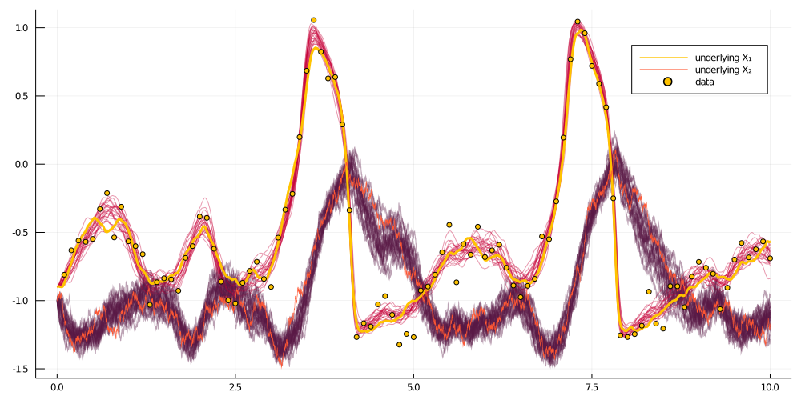

# [How to do smoothing of diffusion trajectories?](@id how_to_smoothing)

Smoothing means reconstruction of the unobserved parts of the path, based on the recorded observations.

We will use an example of the partially observed FitzHugh–Nagumo model.


```julia
# and define a function that does the inference
function simple_smoothing(AuxLaw, recording, dt; ρ=0.5, num_steps=10^4)
	# initializations
	tts = OBS.setup_time_grids(recording, dt)
	ρρ = [ρ for _ in tts]
	PP = build_guid_prop(AuxLaw, recording, tts)

	y1 = rand(recording.x0_prior) # just returns the starting point
	XX, WW, Wnr = rand(PP, y1)
	XX°, WW° = trajectory(PP)

	ll = loglikhd(PP, XX)
	paths = []
	imp_a_r = 0

	# MCMC
	for i in 1:num_steps
		# impute a path
		_, ll° = rand!(PP, XX°, WW°, WW, ρρ, Val(:ll), y1; Wnr=Wnr)

		if rand() < exp(ll°-ll)
			XX, WW, XX°, WW° = XX°, WW°, XX, WW
			ll = ll°
			imp_a_r += 1
		end

		#recompute_guiding_term!(PP°)
		#_, ll° = GP.solve_and_ll!(XX°, WW, PP°, y1)

		# progress message
		if i % 100 == 0
			println("$i. ll=$ll, imputation acceptance rate: $(imp_a_r/100)")
			imp_a_r = 0
		end

		# save intermediate path for plotting
		i % 400 == 0 && append!(paths, [deepcopy(XX)])
	end
	paths
end
```

For instance, for a partially observed FitzHugh–Nagumo model

```julia
paths = simple_smoothing(
	FitzHughNagumoAux, recording, 0.001; ρ=0.96, num_steps=10^4
)
```

