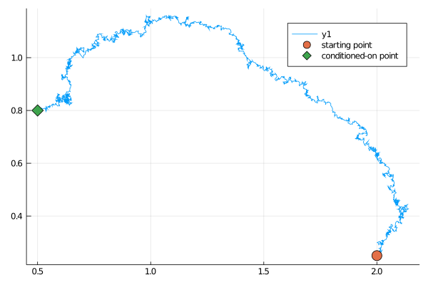
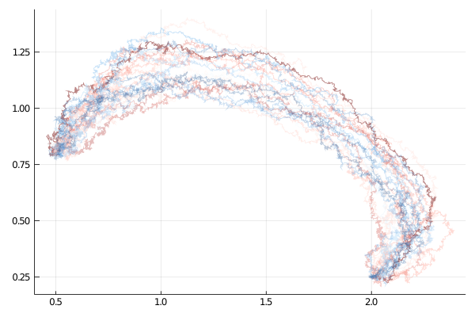

# [Defining guided proposals](@id manual_start)
***************************
The main object used to define guided proposals is
```@docs
GuidedProposals.GuidProp
```
The main role of this object is to facilitate sampling of diffusion paths from some `target` diffusion law by:
- drawing from a `proposal` diffusion law &
- computing an importance sampling weight
Performing these two steps in a setting of importance sampling or mcmc sampling makes it possible to draw sample-paths from the `target` law.

!!! note
    From the conceptual point of view, the target and auxiliary laws, as well as the terminal observations are all required to define a guided proposal. However, conceptually, guided proposals are defined as continuous-time processes, and thus, it should be possible to look-up the value of any sampled trajectory at any time $t\in[0,T]$. `tt`— the time grid on which the path is to be revealed—is thus conceptually superfluous at the time of initialization. Nonetheless, for the purposes that this package was created fixing a time-grid `tt` at initialization of any `GuidProp` is helpful in reducing the computational cost of the algorithm. Currently, if sampling on finer grid is needed at any point, then `GuidProp` object needs to be redefined.


## Defining the target law
----------------------------------------------------------
To define the target law we should make use another package from the [JuliaDiffusionBayes](https://github.com/JuliaDiffusionBayes/) suite: [DiffusionDefinition.jl](https://github.com/JuliaDiffusionBayes/DiffusionDefinition.jl). We can either define the target law using the macro `@define_diffusion` or—if we can—simply load in a pre-defined processes.

!!! tip "Running example—Lotka-Volterra model—defining the target law"

    ```julia
    using DiffusionDefinition
    const DD = DiffusionDefinition
    @load_diffusion LotkaVolterra # for constructing the target law

    θ = [2.0/3.0, 4.0/3.0, 1.0, 1.0, 0.2, 0.2]
    P_target = LotkaVolterra(θ...)
    ```

## Defining the auxiliary law
-----------------------------
When we pass the auxiliary law to `GuidProp` we pass only the name of a struct that defines it and not the actual instance of it. The object will be initialized internally by `GuidProp`. For this reason, the following convention **MUST** be adhered to:
- the auxiliary law is limited to having the same parameter names as the target law; internally `GuidProp` cycles through all parameters needed by the auxiliary law and looks for the corresponding entry in the target law and uses values of the corresponding parameters found there. Importantly, the association is done **by name**
- in addition to parameters the auxiliary law is expected to have the following fields of the type `:auxiliary_info`:
    - `:t0`
    - `:T`
    - `:vT`
Additionally, the field `:xT` will be defined automatically and (if need be) auto-initialized (but can also be declared explicitly).

!!! warning
    No other field from `:auxiliary_info` (apart from explicitly declaring `:xT`) can be used (i.e. fields `:v0` and `:x0`). This last restriction will probably be relaxed in the near future.

!!! tip "Running example—Lotka-Volterra model—defining the auxiliary law"

    ```julia
    @load_diffusion LotkaVolterraAux
    ```

## Defining the terminal observation
------------------------------------
To define the terminal observation we should make use of another package from the [JuliaDiffusionBayes.jl](https://github.com/JuliaDiffusionBayes/JuliaDiffusionBayes.jl) suite: [ObservationSchemes.jl](https://github.com/JuliaDiffusionBayes/ObservationSchemes.jl).


!!! tip "Running example—Lotka-Volterra model—defining the observation"

    Let's initialize an observation sampled according to a scheme:
    $$
    v=X+\eta,\quad \eta\sim N(0,I).
    $$
    ```julia
    using ObservationSchemes, StaticArrays
    t, xₜ = 3.0, @SVector [0.5, 0.8]
    obs = LinearGsnObs(t, xₜ; Σ=1e-4*SDiagonal{2,Float64}(I))
    ```

## Initializing GuidProp
------------------------
It is now possible to define `GuidProp`. We may specify the time-grid, and then, leave the remaining parameters at their defaults. At initialization time a sequence of computations is performed that derive a `guiding term` for `t`'s lying on a pre-specified time-grid `tt`, as well as some additional quantities that are needed for computations of the `log-likelihoods`.

!!! tip "Running example—Lotka-Volterra model—defining GuidProp"

    ```julia
    dt = 0.001
    tt = 0.0:dt:t
    P = GuidProp(tt, P_target, LotkaVolterraAux, obs)
    ```

!!! note
    If at any point the parameters change, then the `guiding term` might need to be re-computed (in fact, this is the centerpiece of the `backward filtering` part of the `forward filtering-backward guiding` algorithm). We provide certain utility functions that facilitate these operations. See ... for more details.


!!! note
    Additional set of options passed to `GuidProp` are specified in the field `solver_choice`, which by default is set to:

    ```julia
    solver_choice=(
          solver=Tsit5(),
          ode_type=:HFc,
          convert_to_HFc=false,
          mode=:outofplace,
          gradients=false,
          eltype=Float64,
    )
    ```

    The constructor expects it to be a NamedTuple with the respective fields (but it is robust enough to fill-in any missing fields with defaults). The meaning of the fields is as follows:
    - `solver` is passed to `DifferentialEquations.jl` to pick an algorithm for solving ODEs that define the guiding term. More about the ODE systems is written in [ODE types](@ref ode_types).
    - `ode_type` is used to pick between three choices of ODE systems to use: `H`, `F`, `c` system, `M`, `L`, `μ` system and `P`, `ν` (and `c`, but `c` needs to be added to names). They have the labels: `:HFc`, `MLμ`, `Pν` respectively, which are not case sensitive and currently only `HFc` is implemented)
    - `convert_to_HFc` is used only when `:MLμ` has been chosen to be a solver of ODEs. In that scenario, if `convert_to_HFc` is set to `true`, then the terms `M`, `L`, `μ` that the ODE systems solve for will be used to compute the corresponding `H`, `F`, `c` terms (as opposed to using `:HFc` solver to solve for them)
    - `mode` is an important flag (currently only `:outofplace` is fully supported) and it is used to tell `GuidProp` what type of computations are being performed: out-of-place `:outofplace`, which are based on `SVector`s from [StaticArrays.jl](https://github.com/JuliaArrays/StaticArrays.jl), in-place `:inplace`, which are based on `Vector`s or `:gpu`, which are based on `cuArray`s.
    - `gradients` is another important flag for telling `GuidProp` whether gradients with respect to something need to be computed.
    - `eltype` ignore this for a moment, we need to figure some things out with this...

# Sampling guided proposals
***************************
Once `GuidProp` has been initialized, trajectories of guided proposals may be sampled from it.
```@docs
GuidedProposals.rand
GuidedProposals.rand!
```

## Sampling a single trajectory
-------------------------------
To sample a single trajectory and initialize appropriate containers in the background call `rand`. Note that `rand` returns two containers (one for the underlying process: `X` and another for the Wiener process: `W`) and a flag for sampling Wiener process `Wnr`. `X`, `W` and `Wnr` may then be used with `rand!` for re-sampling without having to allocate any additional memory.

!!! tip "Running example—Lotka-Volterra model—sampling a single path"

    ```julia
    x0 = @SVector [2.0, 0.25]
    X, W, Wnr = rand(P, x0)

    plot(X, Val(:x_vs_y))
    scatter!([y1[1]],[y1[2]], markersize=8, label="starting point")
    scatter!([vT[1]],[vT[2]], marker=:diamond, markersize=8, label="conditioned-on point")
    ```
    

Alternatively, you may choose to be more explicit: initialize the containers yourself and then call `rand!`. Note however that if the diffusion's state space is not $\RR^d$ you might need to keep re-sampling to make sure the conditions are satisfied.
```julia
# initialize containers
X, W = trajectory(P)
# sample the process
success = false
while !success
    success, _ = rand!(P, X, W, x0; Wnr=Wiener())
end
```

## [Sampling multiple trajectories](@id single_obs_multiple_trajectories)
---------------------------------
Of course, sampling a single trajectory of a guided proposal is usually not the end-goal. We are instead interested in sampling from the target law. To this end we need to not only sample paths, but also compute their log-likelihoods. This can be done in three ways.
1. First, you may simply call `loglikhd` after the path has been sampled to compute the log-likelihood for it
2. Second, just as in [DiffusionDefinition.jl](https://juliadiffusionbayes.github.io/DiffusionDefinition.jl/dev/manual/functionals_of_paths/) `rand` and `rand!` accept a named argument `f` which computes path functionals when sampling. A function that computes the log-likelihood may be passed there.
3. Third—a preferable method—you may call versions of `rand!` that have optimized versions of log-likelihood computations implemented for them.
```julia
success, ll = rand!(P, X, W, Val(:ll), x0; Wnr=Wiener())
```
!!! warning
    `ll` returned by `rand!` is not exactly log-likelihood for the path `XX` and one needs to be careful what is the meaning of it. Consult the [section on log-likelihoods](@ref log_likelihood_computations) to find out more.

With these functions we may very easily perform smoothing to obtain samples under the target law:
```julia
function simple_smoothing(P, y1)
	X, W, Wnr = rand(P, y1)
	X°, W° = trajectory(P)

	ll = loglikhd(P, X)
	paths = []

	for i in 1:10^4
		_, ll° = rand!(P, X°, W°, Val(:ll), y1; Wnr=Wnr)
		if rand() < exp(ll°-ll)
			X, W, X°, W° = X°, W°, X, W
			ll = ll°
		end
		i % 400 == 0 && append!(paths, [deepcopy(X)])
	end
	paths
end
paths = simple_smoothing(P, y1)
```
which results in
```julia
using Plots, Colors
cm = colormap("RdBu")
kwargs = (alpha=0.3, label="")
p = plot(paths[1], Val(:x_vs_y); color=cm[1], kwargs...)
for (i,x) in enumerate(paths[2:end])
	plot!(p, x, Val(:x_vs_y); color=cm[4*i], kwargs...)
end
display(p)
```


## Preconditioned Crank–Nicolson scheme
------------------------
To use the Crank–Nicolson scheme pass additional parameters `W` (the previously accepted Wiener noise) and `ρ` (the memory parameter of the preconditioned Crank–Nicolson scheme to a `rand!` function):
```julia
X°, W° = trajectory(P)
ρ = 0.7
success, ll° = rand!(P, X°, W°, W, ρ, Val(:ll), y1; Wnr=Wnr)
```
