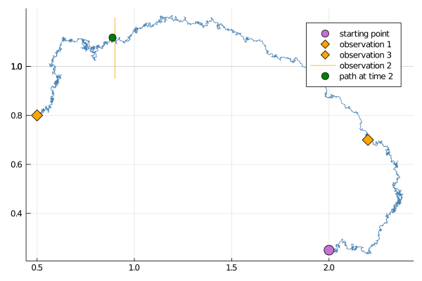
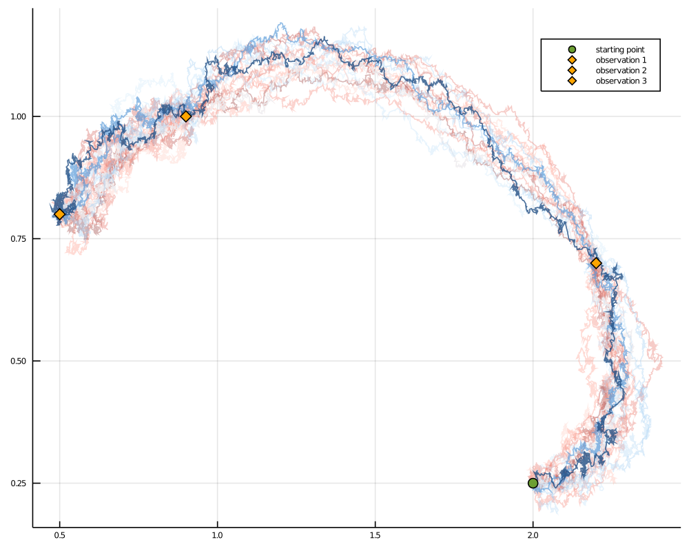

# [Guided proposals with multiple observations](@id multi_obs_gp)
*********************************************
In practice, it is often of interest to sample from some target diffusion law
```math
\dd X_t = b(t,X_t)\dd t + \sigma(t,X_t) \dd W_t,\quad t\in[0,T],\quad X_0\sim p_0,
```
conditionally on multiple, partial observations of $X$:
```math
V_{t_i}:=\left\{ L_iX_{t_i}+\eta_i;i=1,\dots,N \right\},\quad L_i\in\RR^{m_i\times d},\quad \eta_i\sim N(\mu_i,\Sigma_i),
```
not only a single one. This can be done by stacking together `GuidProp`, each defined on its own interval $[t_{i-1},t_{i}]$ and for its own terminal observation $V_{t_i}$. The initialization may be done implicitly if you call
```@docs
GuidedProposals.build_guid_prop
```
For instance:
```julia
observs = load_data(
    ObsScheme(
        LinearGsnObs(
            0.0, zero(SVector{2,Float64});
            Σ = 1e-4*SDiagonal(1.0, 1.0)
        )
    ),
    [1.0, 2.0, 3.0],
    [[2.2, 0.7], [0.9, 1.0], [0.5, 0.8]]
)

recording = (
    P = P_target,
    obs = observs,
    t0 = 0.0,
    x0_prior = undef # normally, we would provide a prior, however for the steps
    # below it is not needed
)
tts = OBS.setup_time_grids(recording, 0.001)

PP = build_guid_prop(LotkaVolterraAux, recording, tts)
```
where we have packaged the observations in a format of a `recording` from [ObservationSchemes.jl](https://github.com/JuliaDiffusionBayes/ObservationSchemes.jl)

!!! note
    It is possible to perform the steps hidden behind a call to `build_guid_prop` explicitly. To properly initialize the guiding term we must defined the sequence of `GuidProp` starting from the last interval $[t_{N-1},t_{N}]$ and proceed moving backwards: $[t_{N-2},t_{N-1}],\dots,[0,t_{1}]$, each time passing a `GuidProp` from the subsequent interval $[t_{i},t_{i+1}]$ to the `GuidProp` that is being defined on $[t_{i-1},t_{i}]$. For the observations above this becomes:

    ```julia
    P_intv3 = GuidProp(tts[3], P_target, LotkaVolterraAux, observs[3])
    P_intv2 = GuidProp(tts[2], P_target, LotkaVolterraAux, observs[2]; next_guid_prop=P_intv3)
    P_intv1 = GuidProp(tts[1], P_target, LotkaVolterraAux, observs[1]; next_guid_prop=P_intv2)
    ```
    That's it, now a vector
    ```julia
    P = [P_intv1, P_intv2, P_intv3]
    ```
    is equivalent to `PP` defined before. Needless to say, calling `build_guid_prop` instead is recommended.

## Sampling a single trajectory
-------------------------------
Sampling is done analogously to how it was done for a case of a single observation. Simply call `rand` if you wish to have containers initialized in the background:
```julia
# sample
XX, WW, Wnr = rand(PP, y1)

# build a plot
p = plot()
for i in 1:3
    plot!(p, XX[i], Val(:x_vs_y); color="steelblue",label="")
end
scatter!(p, [y1[1]],[y1[2]], markersize=8, label="starting point")
for i in 1:3
    o = OBS.obs(recording.obs[i])
    scatter!(p, [o[1]], [o[2]]; label="observation $i", markersize=8, marker=:diamond, markercolor="orange")
end
display(p)
```


Alternatively, initialize containers yourself and then call `rand!`:
```julia
XX, WW = trajectory(PP)
rand!(PP, XX, WW, y1)
```

## Sampling multiple trajectories
---------------------------------
As it was the case with single observation, sampling multiple trajectories often involves computation of the log-likelihood. Analogously to how it was explained in the [previous section](@ref single_obs_multiple_trajectories), there are three ways of computing log-likelihood and the preferred way is to use the optimized `rand!` samplers that compute log-likelihoods as the path is being sampled.

```julia
success, ll = rand!(PP, XX, WW, Val(:ll), y1)
```

Smoothing is now as simple as it was for a single observation. In fact, thanks to the magic of Julia's multiple dispatch we may call the exact same function `simple_smoothing` that was defined in the [previous section](@ref single_obs_multiple_trajectories) and it will work for multiple observations as well!
```julia
paths = simple_smoothing(P, y1)
```


!!! note
    A log-likelihood computed by `rand!` for a list of trajectories is slightly different than the log-likelihood computed for a single segment. An additional term due to transition densities is added. See the [section on log-likelihoods](@ref log_likelihood_computations) for more details.

## Preconditioned Crank-Nicolson scheme
---------------------------------------
Perturbing Gaussian noise instead of sampling it anew works in exactly the same way as in the previous section.
```julia
XX°, WW° = trajectory(PP)
ρ = 0.5 # one memory param for the entire interval
rand!(PP, XX°, WW°, WW, ρ, y1)
```
