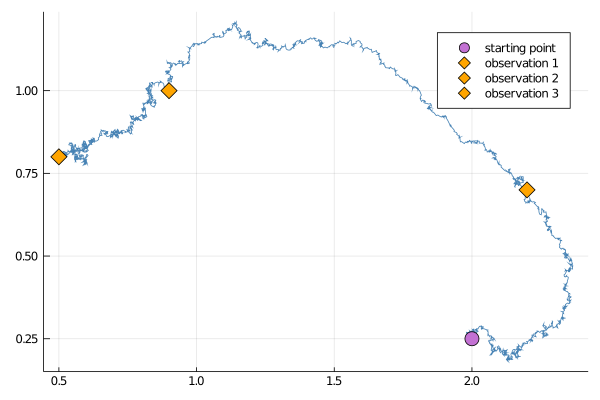

# Guided proposals with multiple observations
*********************************************
In practice, it is often of interest to sample from some target diffusion law
```math
\dd X_t = b(t,X_t)\dd t + \sigma(t,X_t) \dd W_t,\quad t\in[0,T],\quad X_0\sim p_0,
```
conditionally on multiple, partial observations of $X$:
```math
V_{t_i}:=\left\{ L_iX_{t_i}+\eta_i;i=1,\dots,N \right\},\quad L_i\in\RR^{m_i\times d},\quad \eta_i\sim N(\mu_i,\Sigma_i),
```
not only a single one. This can be done by stacking together `GuidProp`, each defined on its own interval $[t_{i-1},t_{i}]$ and for its own terminal observation $V_{t_i}$. The initialization may be done implicitly if you call
```@docs
GuidedProposals.build_guid_prop
```
For instance:
```julia
recording = (
    P = P_target,
    obs = [
	    LinearGsnObs(
	        1.0, (@SVector [2.2, 0.7]);
	        Σ = 1e-4*SDiagonal(1.0, 1.0)
	    ),
	    LinearGsnObs(
	        2.0, (@SVector [0.9]);
	        L = (@SMatrix [1.0 0.0]), Σ = 1e-4*SDiagonal(1.0)
	    ),
	    LinearGsnObs(
	        3.0, (@SVector [0.5, 0.8]);
	        Σ = 1e-4*SDiagonal(1.0, 1.0)
	    )
	],
    t0 = 0.0,
    x0_prior = undef # normally, we would provide a prior, however for the steps
    # below it is not needed
)

dt = 0.001
tts = [
    0.0:dt:(observs[1].t),
    (observs[1].t):dt:(observs[2].t),
    (observs[2].t):dt:(observs[3].t),
]

P = build_guid_prop(LotkaVolterraAux, recording, tts)
```
where we have packaged the observations in a format of a `recording` from [ObservationSchemes.jl](https://github.com/JuliaDiffusionBayes/ObservationSchemes.jl)

!!! note
    It is possible to perform the steps hidden behind a call to `build_guid_prop` explicitly. To properly initialize the guiding term we must defined the sequence of `GuidProp` starting from the last interval $[t_{N-1},t_{N}]$ and proceed moving backwards: $[t_{N-2},t_{N-1}],\dots,[0,t_{1}]$, each time passing a `GuidProp` from the subsequent interval $[t_{i},t_{i+1}]$ to the `GuidProp` that is being defined on $[t_{i-1},t_{i}]$. For the observations above this becomes:

    ```julia
    P_intv3 = GuidProp(tts[3], P_target, LotkaVolterraAux, observs[3])
    P_intv2 = GuidProp(tts[2], P_target, LotkaVolterraAux, observs[2]; next_guid_prop=P_intv3)
    P_intv1 = GuidProp(tts[1], P_target, LotkaVolterraAux, observs[1]; next_guid_prop=P_intv2)
    ```
    That's it, now a vector
    ```julia
    P = [P_intv1, P_intv2, P_intv3]
    ```
    is equivalent to `P` defined before. Needless to say, calling `build_guid_prop` instead is recommended.

## Sampling a single trajectory
Sampling is done analogously to how it was done for a case of a single observation. Simply call `rand` if you wish to have containers initialized in the background:
```julia
XX, WW, Wnr = rand(P, y1)
```


Alternatively, initialize the containers yourself and then call `rand!`:
```julia
XX, WW = trajectory(P)
rand!(P, ...)
```
