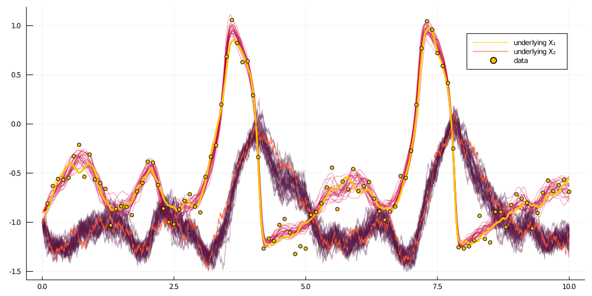

# Setting up a blocking scheme for a simple smoothing problem
***
> In this tutorial we will smooth trajectories of a diffusion process (based on discrete-time observations of its sampled trajectory) using guided proposals with a blocking scheme. We will apply the algorithm to an example of a hypoelliptic FitzHugh–Nagumo model.

!!! unknown "note"
    The most convenient way of smoothing diffusion trajectories with blocking is to use the [DiffusionMCMC.jl](https://github.com/JuliaDiffusionBayes/DiffusionMCMC.jl) package. For the pedagogical purposes we explain how to do it without this package, using solely [DiffusionDefinition.jl](https://github.com/JuliaDiffusionBayes/DiffusionDefinition.jl), [ObservationSchemes.jl](https://github.com/JuliaDiffusionBayes/ObservationSchemes.jl) and [GuidedProposals.jl](https://github.com/JuliaDiffusionBayes/GuidedProposals.jl).

## Introduction
---
This tutorial is an extension of the previous tutorial on [smoothing of diffusion trajectories](@ref tutorial_smoothing). We use the same example and the same generated data. For more information about the model see [the previous tutorial](@ref tutorial_smoothing).

## Prerequisites, data generation and data preparation
----
We need the same packages as last time. We will use the same data that we generated for the last tutorial. The preparation steps remain unchanged.

## Blocking
-----
Blocking is a technique of sampling diffusion trajectories where only segments of paths (as opposed to a full path) are ever updated at a time. The quickest way to understand it is to look at an animation

[TODO add animation]

[TODO add description]

Translated to computer code, each block will be represented by an appropriate view to the containers that are pertinent to the entire trajectory. More precisely, we should again have the same `Workspace` struct from the previous tutorial, but now, we should additionally have the struct `Block` that you can think of as a window that restricts a view to `Workspace` to certain segments. There is one additional detail. The last segment of each block is a tad special. The terminal observation on such an interval is not the observation from the dataset, but instead, an **exact** and **artificial** observation that corresponds to a value taken at a given time-point by the previously accepted trajectory. As a result, the `GuidProp` defined on this interval must have the observation field `obs`, as well as the auxiliary law `P_aux` appropriately modified. As these changes may in principle (and often would) break the type-stability of `GuidProp`, we must define a separate `GuidProp` that can handle exact observation and that will be used with blocking on a given interval. And a final–final detail, the last explanation applies to all final intervals of each block, **with the exception of the last block**. On the last block the terminal observation is never changed to an artificial one.

Consequently, the `Block` struct might look as follows:

```julia
const TVIEW{T} = SubArray{T,1,Array{T,1},Tuple{UnitRange{Int64}},true}

mutable struct Block{GP,GPl,TX,TW,TWnr,Ty1}
    PP::TVIEW{GP}
    P_last::GPl
    XX::TVIEW{TX}
    XX°::TVIEW{TX}
    WW::TVIEW{TW}
    WW°::TVIEW{TW}
    ρρ::TVIEW{Float64}
    Wnr::TWnr
    y1::Ty1

    function Block(
            ws::Workspace{GP,TX,TW,TWnr,Ty1},
            range::UnitRange{Int64},
            AuxLawBlocking,
            artificial_noise=1e-11,
            last_block=false
        ) where {GP,TX,TW,TWnr,Ty1}
        PP = view(ws.PP, range[1]:(range[end]-!last_block)) # omit the last law
        P_last = (
            last_block ?
            nothing :
            guid_prop_for_blocking(
                ws.PP[range[end]], AuxLawBlocking, artificial_noise
            )
        )

        XX = view(ws.XX, range)
        XX° = view(ws.XX°, range)
        WW = view(ws.WW, range)
        WW° = view(ws.WW°, range)
        ρρ = view(ws.ρρ, range)

        new{GP,typeof(P_last),TX,TW,TWnr,Ty1}(
            PP, P_last, XX, XX°, WW, WW°, ρρ, ws.Wnr, deepcopy(ws.y1)
        )
    end
end
```

As in the case of smoothing, we should also declare how the sampling of paths should look like, as well as how the containers should be swapped in case of acceptance. The first procedure will differ a little depending on whether we work with the last block or not:

```julia
# NOT the last block
function draw_proposal!(b::Block)
    # sample a path on a given block
    _, ll° = rand!(b.PP, b.XX°, b.WW°, b.WW, b.ρρ, Val(:ll), b.y1; Wnr=b.Wnr)
    # sample the last segment using a different law
    y = b.XX°[end-1].x[end]
    _, ll°_last = rand!(
        b.P_last, b.XX°[end], b.WW°[end], b.WW[end], b.ρρ[end], Val(:ll), y;
        Wnr=b.Wnr
    )
    ll° + ll°_last
end

# the last block
function draw_proposal!(b::Block{GP,Nothing}) where GP
    # sample a path on a given block
    _, ll° = rand!(b.PP, b.XX°, b.WW°, b.WW, b.ρρ, Val(:ll), b.y1; Wnr=b.Wnr)
    ll°
end

function swap_paths!(b::Block)
    for i in eachindex(b.XX)
        b.XX[i], b.XX°[i] = b.XX°[i], b.XX[i]
        b.WW[i], b.WW°[i] = b.WW°[i], b.WW[i]
    end
end
```

We could now go ahead and implement smoothing with blocking algorithm, but we can make our lives a tiny bit easier later on by writing some additional helper functions that work with blocks. First of, with blocking we must be able to set the artificial observation:

```julia
# we will be extending functions from GuidedProposals module, hence `GP.`
GP.set_obs!(b::Block) = set_obs!(b.P_last, b.XX[end].x[end])
GP.set_obs!(b::Block{T,Nothing}) where T = nothing
```

The artificial observation `b.XX[end].x[end]` will not only become the conditioned-on terminal observation in a given block, but also, it will become the starting position for the subsequent block. Let's define a function that sets the starting position as well:

```julia
reset_y1!(b::Block) = (b.y1 = b.XX[1].x[1])
```

Once the observation is set, we should also be able to recompute the guiding term. This re-computation will slightly differ depending on whether we are dealing with the last block or not

```julia
# NOT the last block
GP.recompute_guiding_term!(b::Block) = recompute_guiding_term!(b.PP, b.P_last)

# the last block
function GP.recompute_guiding_term!(b::Block{T,Nothing}) where T
    recompute_guiding_term!(b.PP)
end
```
After re-computing the guiding term we should find the Wiener noise that reconstructs the already accepted path `X` for a given guiding term:

```julia
# NOT the last block
function find_W_for_X!(b::Block)
    for i in eachindex(b.PP)
        DD.invsolve!(b.XX[i], b.WW[i], b.PP[i])
    end
    DD.invsolve!(b.XX[end], b.WW[end], b.P_last)
end

# the last block
function find_W_for_X!(b::Block{GP,Nothing}) where GP
    for i in eachindex(b.PP)
        DD.invsolve!(b.XX[i], b.WW[i], b.PP[i])
    end
end
```

Finally, we should be able to re-evaluate the log-likelihood for the accepted path once the guiding term has changed:

```julia
# NOT the last block
GP.loglikhd(b::Block) = loglikhd(b.PP, b.XX) + loglikhd(b.P_last, b.XX[end])

# the last block
GP.loglikhd(b::Block{T,Nothing}) where T = loglikhd(b.PP, b.XX)
```
We should be good to go.

## Smoothing algorithm with blocking
---
```julia
function simple_smoothing_with_blocking(
        AuxLaw, recording, dt;
        ρ=0.5, num_steps=10^4, AuxLawBlocking=AuxLaw, artificial_noise=1e-6
    )
    ws = Workspace(AuxLaw, recording, dt, ρ)

    #--------------------------------------------------------------------------#
    #                          Blocking setup                                  #
    #--------------------------------------------------------------------------#
    # let's do some very simple blocking based on three points                 #
                                                                               #
    # place three ~equidistant points                                          #
    num_intv = length(ws.PP)                                                   #
    one_quarter_pt = div(num_intv, 4)                                          #
    one_half_pt = div(num_intv, 2)                                             #
    three_quarter_pt = one_half_pt + one_quarter_pt                            #
                                                                               #
    # alias                                                                    #
    ϵ = artificial_noise                                                       #
                                                                               #
    # define two sets of blocks                                                #
    B1 = [                                                                     #
        Block(ws, 1:one_half_pt, AuxLaw, ϵ),                                   #
        Block(ws, (one_half_pt+1):num_intv, AuxLaw, ϵ, true)                   #
    ]                                                                          #
    B2 = [                                                                     #
        Block(ws, 1:one_quarter_pt, AuxLaw, ϵ),                                #
        Block(ws, (one_quarter_pt+1):three_quarter_pt, AuxLaw, ϵ),             #
        Block(ws, (three_quarter_pt+1):num_intv, AuxLaw, ϵ, true)              #
    ]                                                                          #
    sets_of_blocks = [B1, B2]                                                  #
                                                                               #
    num_accpt = [[0,0], [0,0,0]]                                               #
    lls = [[0.0, 0.0], [0.0, 0.0, 0.0]]                                        #
    #--------------------------------------------------------------------------#

    # MCMC
    for i in 1:num_steps
        # iterate over sets of blocks
        for (Bidx, B) in enumerate(sets_of_blocks)
            # set auxiliary points
            set_obs!.(B)

            # the guiding term must be recomputed...
            recompute_guiding_term!.(B)

            # find a Wiener path W reconstructing the trajectory X
            find_W_for_X!.(B)

            # impute the path
            for k in eachindex(B)
                ll° = draw_proposal!(B[k])

                # compute log-likelihood on this interval for the accepted path
                ll = loglikhd(B[k])

                lls[Bidx][k] = ll # save for printing
                if rand() < exp(ll°-ll)
                    swap_paths!(B[k])
                    num_accpt[Bidx][k] += 1
                    lls[Bidx][k] = ll°
                end
                # update the starting point on the subsequent block
                (k<length(B)) && reset_y1!(B[k+1])
            end
        end

        # progress message
        if i % 100 == 0
            msg = "$i. "
            for j in eachindex(sets_of_blocks)
                for k in eachindex(lls[j])
                    msg = msg*"ll_$j$k=$(lls[j][k]) (ar$j$k=$(num_accpt[j][k]/100)), "
                end
            end
            println(msg)
            num_accpt[1] .= 0
            num_accpt[2] .= 0
        end

        # save intermediate path for plotting
        i % 400 == 0 && append!(paths, [deepcopy(ws.XX)])
    end
    paths
end
```

## Results
-----
Before applying the routine to the data we need to do one last step. FitzHugh–Nagumo diffusion is a type of a hypoelliptic diffusion with a degenerate noise structure. For this type of processes we need to declare the behaviour of two functions from the [DiffusionDefinition.jl](https://juliadiffusionbayes.github.io/DiffusionDefinition.jl/dev/) module: `nonhypo` and `nonhypo_σ`. The reason for this is additional requirement is a step of computing the Wiener path from the sampled trajectory $X$. Coordinates that have zero Wiener noise contribute nothing to the process of finding $W$ from $X$, so we need to indicate to `Julia` which information is relevant for this step and which is not.

!!! warning
    Note that we access a subvector of x using **static arrays**! This is very important if the state of your diffusion is represented with static arrays as well. Otherwise the output of `nonhypo` will be a regular vector, Julia will have to perform computations on a mix of regular and static vectors and your code will be unnecessarily slow!

```julia
@load_diffusion FitzHughNagumoAux
@inline DD.nonhypo(x, P::FitzHughNagumo) = x[SVector{1,Int64}(2)]
@inline DD.nonhypo_σ(t::Float64, x, P::FitzHughNagumo) = SMatrix{1,1,Float64}(P.σ)
```

We are ready to run the algorithm. It takes about 56seconds on my laptop.
```julia
paths = simple_smoothing_with_blocking(
    FitzHughNagumoAux, recording, 0.001; ρ=0.84, num_steps=10^4, artificial_noise=1e-12
)
```

!!! note
    If you read through a [how-to-guide on blocking](@ref how_to_do_blocking), then you might have remembered that the code written there took only $50$seconds to execute on my laptop. Where is the difference coming from? If you recall from the how-to-guide, we were a bit more verbatim and we decided not to recompute the guiding term on the last block from a second blocking set (as it will never change). We could do the same thing here, but instead, we opted for neatness of the code. If this step is performed also in the how-to-guide then both routines take the same amount of time to execute.

We can now view the paths in the same way as in the previous tutorial


## Concluding remarks
----
TODO

!!! tip
    It should be straightforward to extend this to different diffusion laws, as well as to different blocking scheme. How would you implement a random blocking scheme? (Hint: you need to remove `P_last` from the definition of `Block` to avoid re-allocations of memory).

# Full code from the tutorial
***
```julia
using GuidedProposals, DiffusionDefinition, ObservationSchemes
const GP = GuidedProposals
const DD = DiffusionDefinition
const OBS = ObservationSchemes

using StaticArrays, Random, Plots

# seed used for this tutorial
Random.seed!(100)

@load_diffusion FitzHughNagumo
θ = [0.1, -0.8, 1.5, 0.0, 0.3]
P = FitzHughNagumo(θ...)
tt, y1 = 0.0:0.0001:10.0, @SVector [-0.9, -1.0]
X = rand(P, tt, y1)
data = map(
	x->(x[1], x[2][1] + 0.1randn()),
	collect(zip(X.t, X.x))[1:1000:end]
)[2:end]

plot(X, Val(:vs_time), size=(800, 300))
scatter!(map(x->x[1], data), map(x->x[2], data), label="data")

recording = (
    P = P, # diffusion law
    obs = load_data(
        ObsScheme(
            LinearGsnObs(
                0.0, (@SVector [0.0]); # dummy variables indicating datatype of observations
                L=(@SMatrix [1.0 0.0]), # observation operator
                Σ=(@SMatrix [0.01]) # noise on the observations
            )
        ),
        data
    ),
    t0 = 0.0,
    x0_prior = KnownStartingPt(y1),
)

mutable struct Workspace{GP,TX,TW,TWnr,Ty1}
    PP::Vector{GP}
    XX::Vector{TX}
    XX°::Vector{TX}
    WW::Vector{TW}
    WW°::Vector{TW}
    ρρ::Vector{Float64}
    Wnr::TWnr
    y1::Ty1

    function Workspace(AuxLaw, recording, dt, ρ)
        # time-grids for the forward-simulation of trajectories
        tts = OBS.setup_time_grids(recording, dt, standard_guid_prop_time_transf)
        # memory parameters for the preconditioned Crank-Nicolson scheme
        ρρ = [ρ for _ in tts]
        # laws of guided proposals
        PP = build_guid_prop(AuxLaw, recording, tts)

        y1 = rand(recording.x0_prior)
        # initialize the `accepted` trajectory
        XX, WW, Wnr = rand(PP, y1)
        # initialize the containers for the `proposal` trajectory
        XX°, WW° = trajectory(PP)

        # initialize the workspace
        new{eltype(PP),eltype(XX),eltype(WW),typeof(Wnr),typeof(y1)}(
            PP, XX, XX°, WW, WW°, ρρ, Wnr, y1
        )
    end
end

#------------------------------------------------------------------------------#
#                            START OF NEW CODE                                 #
#------------------------------------------------------------------------------#

const TVIEW{T} = SubArray{T,1,Array{T,1},Tuple{UnitRange{Int64}},true}

mutable struct Block{GP,GPl,TX,TW,TWnr,Ty1}
    PP::TVIEW{GP}
    P_last::GPl
    XX::TVIEW{TX}
    XX°::TVIEW{TX}
    WW::TVIEW{TW}
    WW°::TVIEW{TW}
    ρρ::TVIEW{Float64}
    Wnr::TWnr
    y1::Ty1

    function Block(
            ws::Workspace{GP,TX,TW,TWnr,Ty1},
            range::UnitRange{Int64},
            AuxLawBlocking,
            artificial_noise=1e-11,
            last_block=false
        ) where {GP,TX,TW,TWnr,Ty1}
        PP = view(ws.PP, range[1]:(range[end]-!last_block)) # omit the last law
        P_last = (
            last_block ?
            nothing :
            guid_prop_for_blocking(
                ws.PP[range[end]], AuxLawBlocking, artificial_noise
            )
        )

        XX = view(ws.XX, range)
        XX° = view(ws.XX°, range)
        WW = view(ws.WW, range)
        WW° = view(ws.WW°, range)
        ρρ = view(ws.ρρ, range)

        new{GP,typeof(P_last),TX,TW,TWnr,Ty1}(
            PP, P_last, XX, XX°, WW, WW°, ρρ, ws.Wnr, deepcopy(ws.y1)
        )
    end
end

# NOT the last block
function draw_proposal!(b::Block)
    # sample a path on a given block
    _, ll° = rand!(b.PP, b.XX°, b.WW°, b.WW, b.ρρ, Val(:ll), b.y1; Wnr=b.Wnr)
    # sample the last segment using a different law
    y = b.XX°[end-1].x[end]
    _, ll°_last = rand!(
        b.P_last, b.XX°[end], b.WW°[end], b.WW[end], b.ρρ[end], Val(:ll), y;
        Wnr=b.Wnr
    )
    ll° + ll°_last
end

# the last block
function draw_proposal!(b::Block{GP,Nothing}) where GP
    # sample a path on a given block
    _, ll° = rand!(b.PP, b.XX°, b.WW°, b.WW, b.ρρ, Val(:ll), b.y1; Wnr=b.Wnr)
    ll°
end

function swap_paths!(b::Block)
    for i in eachindex(b.XX)
        b.XX[i], b.XX°[i] = b.XX°[i], b.XX[i]
        b.WW[i], b.WW°[i] = b.WW°[i], b.WW[i]
    end
end

# we will be extending functions from GuidedProposals module, hence `GP.`
GP.set_obs!(b::Block) = set_obs!(b.P_last, b.XX[end].x[end])
GP.set_obs!(b::Block{T,Nothing}) where T = nothing
reset_y1!(b::Block) = (b.y1 = b.XX[1].x[1])
# NOT the last block
GP.recompute_guiding_term!(b::Block) = recompute_guiding_term!(b.PP, b.P_last)

# the last block
function GP.recompute_guiding_term!(b::Block{T,Nothing}) where T
    recompute_guiding_term!(b.PP)
end
# NOT the last block
function find_W_for_X!(b::Block)
    for i in eachindex(b.PP)
        DD.invsolve!(b.XX[i], b.WW[i], b.PP[i])
    end
    DD.invsolve!(b.XX[end], b.WW[end], b.P_last)
end

# the last block
function find_W_for_X!(b::Block{GP,Nothing}) where GP
    for i in eachindex(b.PP)
        DD.invsolve!(b.XX[i], b.WW[i], b.PP[i])
    end
end

# NOT the last block
GP.loglikhd(b::Block) = loglikhd(b.PP, b.XX) + loglikhd(b.P_last, b.XX[end])

# the last block
GP.loglikhd(b::Block{T,Nothing}) where T = loglikhd(b.PP, b.XX)

function simple_smoothing_with_blocking(
        AuxLaw, recording, dt;
        ρ=0.5, num_steps=10^4, AuxLawBlocking=AuxLaw, artificial_noise=1e-6
    )
    ws = Workspace(AuxLaw, recording, dt, ρ)
    paths = []

    #--------------------------------------------------------------------------#
    #                          Blocking setup                                  #
    #--------------------------------------------------------------------------#
    # let's do some very simple blocking based on three points                 #
                                                                               #
    # place three ~equidistant points                                          #
    num_intv = length(ws.PP)                                                   #
    one_quarter_pt = div(num_intv, 4)                                          #
    one_half_pt = div(num_intv, 2)                                             #
    three_quarter_pt = one_half_pt + one_quarter_pt                            #
                                                                               #
    # alias                                                                    #
    ϵ = artificial_noise                                                       #
                                                                               #
    # define two sets of blocks                                                #
    B1 = [                                                                     #
        Block(ws, 1:one_half_pt, AuxLaw, ϵ),                                   #
        Block(ws, (one_half_pt+1):num_intv, AuxLaw, ϵ, true)                  #
    ]                                                                          #
    B2 = [                                                                     #
        Block(ws, 1:one_quarter_pt, AuxLaw, ϵ),                                #
        Block(ws, (one_quarter_pt+1):three_quarter_pt, AuxLaw, ϵ),             #
        Block(ws, (three_quarter_pt+1):num_intv, AuxLaw, ϵ, true)             #
    ]                                                                          #
    sets_of_blocks = [B1, B2]                                                  #
                                                                               #
    num_accpt = [[0,0], [0,0,0]]                                               #
    lls = [[0.0, 0.0], [0.0, 0.0, 0.0]]                                        #
    #--------------------------------------------------------------------------#

    # MCMC
    for i in 1:num_steps
        # iterate over sets of blocks
        for (Bidx, B) in enumerate(sets_of_blocks)
            # set auxiliary points
            set_obs!.(B)

            # the guiding term must be recomputed...
            recompute_guiding_term!.(B)

            # find a Wiener path W reconstructing the trajectory X
            find_W_for_X!.(B)

            # impute the path
            for k in eachindex(B)
                ll° = draw_proposal!(B[k])

                # compute log-likelihood on this interval for the accepted path
                ll = loglikhd(B[k])

                lls[Bidx][k] = ll # save for printing
                if rand() < exp(ll°-ll)
                    swap_paths!(B[k])
                    num_accpt[Bidx][k] += 1
                    lls[Bidx][k] = ll°
                end
                # update the starting point on the subsequent block
                (k<length(B)) && reset_y1!(B[k+1])
            end
        end

        # progress message
        if i % 100 == 0
            msg = "$i. "
            for j in eachindex(sets_of_blocks)
                for k in eachindex(lls[j])
                    msg = msg*"ll_$j$k=$(lls[j][k]) (ar$j$k=$(num_accpt[j][k]/100)), "
                end
            end
            println(msg)
            num_accpt[1] .= 0
            num_accpt[2] .= 0
        end

        # save intermediate path for plotting
        i % 400 == 0 && append!(paths, [deepcopy(ws.XX)])
    end
    paths
end


@load_diffusion FitzHughNagumoAux
@inline DD.nonhypo(x, P::FitzHughNagumo) = x[SVector{1,Int64}(2)]
@inline DD.nonhypo_σ(t::Float64, x, P::FitzHughNagumo) = SMatrix{1,1,Float64}(P.σ)

paths = simple_smoothing_with_blocking(
    FitzHughNagumoAux, recording, 0.001; ρ=0.84, num_steps=10^4, artificial_noise=1e-12
)

#------------------------------------------------------------------------------#
#                              END OF NEW CODE                                 #
#------------------------------------------------------------------------------#

function glue_paths(XX)
    XX_glued = trajectory(
        glue_containers( map(x->x.t, XX) ),
        glue_containers( map(x->x.x, XX) ),
    )
end

function glue_containers(xs)
    glued_xs = collect(Iterators.flatten(map(x->x[1:end-1], xs)))
    append!(glued_xs, [xs[end][end]])
    glued_xs
end

convenient_paths = glue_paths.(paths)

col = ["#581845", "#900C3F", "#C70039", "#FF5733", "#FFC300"]

p = plot(size=(1000, 500))
for path in convenient_paths
	plot!(p, path, Val(:vs_time), alpha=0.4, label="", color=[col[3] col[1]])
end
plot!(X, Val(:vs_time), color=[col[5] col[4]], linewidth=[3 0.5], label=["underlying X₁" "underlying X₂"])
scatter!(p, map(x->x[1], data), map(x->x[2], data), label="data", markercolor=col[5])
display(p)
```
