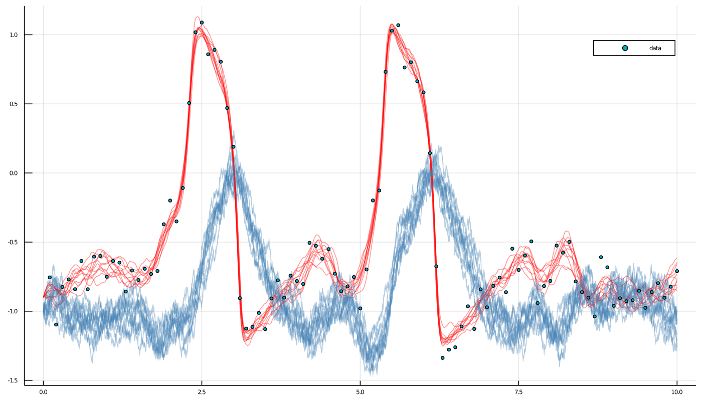

# Parameter inference on the example of FitzHugh-Nagumo model
> In this tutorial we will explain how to perform Bayesian inference via MCMC sampling with [GuidedProposals.jl](https://github.com/JuliaDiffusionBayes/GuidedProposals.jl/dev) on the example of the FitzHugh-Nagumo model. We will write a Metropolis-within-Gibbs algorithm that alternately imputes the unobserved path and updates unknown parameter. We will conduct inference for a single parameter, but it will be clear how to extend this tutorial to multiple parameters.

## Introduction

## Prerequisites

```julia
using GuidedProposals, DiffusionDefinition, ObservationSchemes
const GP = GuidedProposals
const DD = DiffusionDefinition
const OBS = ObservationSchemes

using StaticArrays, Random, Plots
```

## Data generation

```julia
@load_diffusion FitzHughNagumo
# generate some data
θ = [0.1, -0.8, 1.5, 0.0, 0.3]
P = FitzHughNagumo(θ...)
tt, y1 = 0.0:0.0001:10.0, @SVector [-0.9, -1.0]
X = rand(P, tt, y1)
data = map(
	x->(x[1], x[2][1] + 0.1randn()),
	collect(zip(X.t, X.x))[1:1000:end]
)[2:end]
#TODO introduce data collection in `ObservationSchemes.jl` with `ObsScheme()` object
```

```julia
# let's examine the data
plot(X, Val(:vs_time), size=(800, 300))
scatter!(map(x->x[1], data), map(x->x[2], data), label="data")
```


## Data preparation
```julia
# let's prepare the data
recording = (
	P = FitzHughNagumo([0.1, #==# 0.0 #==#, 1.5, 0.0, 0.3]...),
	obs = load_data(
		ObsScheme(
			LinearGsnObs(
				0.0, (@SVector [0.0]);
				L=(@SMatrix [1.0 0.0]), Σ=(@SMatrix [0.01])
			)
		),
		data
	),
	t0 = 0.0,
	x0_prior = KnownStartingPt(y1),
)
```


## Inference algorithm

```julia
# define a simple transition kernel
function customkernel(θ, s::Symbol, scale=0.1)
	θ° = deepcopy(θ)
	θ°[s] += 2.0*scale*(rand()-0.5)
	θ°
end

# and define a function that does the inference
function simple_inference(AuxLaw, recording, dt, θ; ρ=0.5, num_steps=10^4)
	# initializations
	tts = OBS.setup_time_grids(recording, dt)
	ρρ = [ρ for _ in tts]
	PP = build_guid_prop(AuxLaw, recording, tts)
	PP° = deepcopy(PP)

	y1 = rand(recording.x0_prior) # just returns the starting point
	XX, WW, Wnr = rand(PP, y1)
	XX°, WW° = trajectory(PP)

	ll = loglikhd(PP, XX)
	paths = []
	θθ = Float64[θ[:s],]
	imp_a_r = 0
	param_a_r = 0

	# MCMC
	for i in 1:num_steps
		# impute a path
		_, ll° = rand!(PP, XX°, WW°, WW, ρρ, Val(:ll), y1; Wnr=Wnr)

		if rand() < exp(ll°-ll)
			XX, WW, XX°, WW° = XX°, WW°, XX, WW
			ll = ll°
			imp_a_r += 1
		end

		# update parameter s
		θ° = customkernel(θ, :s, 0.3)
		DD.set_parameters!(PP°, θ°)
		recompute_guiding_term!(PP°)
		_, ll° = GP.solve_and_ll!(XX°, WW, PP°, y1)

		if rand() < exp(ll°-ll) # uniform updates have no contribution to ll
			XX, PP, θ, XX°, PP°, θ° = XX°, PP°, θ°, XX, PP, θ
			ll = ll°
			param_a_r += 1
		end
		append!(θθ, [θ[:s]])


		# progress message
		if i % 100 == 0
			println(
				"$i. ll=$ll, s=$(θ[:s]), imp accpt rate: $(imp_a_r/100), ",
				"updt accpt rate: $(param_a_r/100)"
			)
			imp_a_r = param_a_r = 0
		end

		# save intermediate path for plotting
		i % 400 == 0 && append!(paths, [deepcopy(XX)])
	end
	paths, θθ
end
```

## Performing inference
```julia
@load_diffusion FitzHughNagumoAux
# let's declare which parameters are not changing
DD.const_parameter_names(::Type{<:FitzHughNagumo}) = (:ϵ, :γ, :β, :σ)
DD.const_parameter_names(::Type{<:FitzHughNagumoAux}) = (:ϵ, :γ, :β, :σ, :t0, :T, :vT, :xT)

# and do the inference
paths, θθ = simple_inference(
	FitzHughNagumoAux, recording, 0.001, Dict(:s=>0.0); ρ=0.96, num_steps=10^4
)
```
It takes about 45sec on my laptop...

## Examining the results

```julia
plot(θθ)
```


```julia
p = plot(size=(1400, 800))
for path in paths[end-10:end]
	for i in eachindex(path)
		plot!(p, path[i], Val(:vs_time), alpha=0.4, label="", color=["red" "steelblue"])
	end
end
scatter!(p, map(x->x[1], data), map(x->x[2], data), label="data")
display(p)
```



!!! tip
    Adjusting the code presented in this tutorial to other diffusion processes, observation schemes or flavors of MCMC algorithm should be fairly straightforward, albeit can become tedious. Package [DiffusionMCMC.jl](https://github.com/JuliaDiffusionBayes/DiffusionMCMC.jl/dev) (currently under development) has been designed precisely with this in mind and aims to remove the unnecessary, tedious work from the user when performing MCMC inference.
