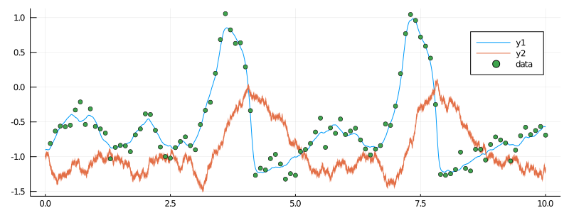

# [Smoothing trajectories of the partially observed FitzHugh–Nagumo diffusion](@id tutorial_smoothing)
***
> In this tutorial we will smooth trajectories of a diffusion process, based on discrete-time observations of its sampled trajectory. We will apply the algorithm to an example of a hypoelliptic FitzHugh—Nagumo model.

!!! unknown "note"
    The most convenient way of smoothing diffusion trajectories is to use the [DiffusionMCMC.jl](https://github.com/JuliaDiffusionBayes/DiffusionMCMC.jl) package. For the pedagogical purposes we explain how to do it without this package, using solely [DiffusionDefinition.jl](https://github.com/JuliaDiffusionBayes/DiffusionDefinition.jl), [ObservationSchemes.jl](https://github.com/JuliaDiffusionBayes/ObservationSchemes.jl) and [GuidedProposals.jl](https://github.com/JuliaDiffusionBayes/GuidedProposals.jl).

## Introduction
----
FitzHugh—Nagumo model is given by the following system of ODEs:
```math
\begin{align*}
\frac{\dd}{\dd t} y(t) &= \frac{1}{ϵ}\left( y(t) - y^3(t)-x(t) + s \right ),\\
\frac{\dd}{\dd t} x(t) &= γ y(t) - x(t) + β,
\end{align*}
```
where $(ϵ, s, γ, β)$ are the model parameters. A stochastic version of this model is obtained by adding a Wiener noise to top, bottom or both terms above. For this tutorial we consider the following hypoelliptic stochastic differential equation corresponding to a stochastic version of the FitzHugh–Nagumo model:
```math
\begin{align*}
\dd Y_t &= \frac{1}{\epsilon}\left( Y_t - Y_t^3-X_t + s \right )\dd t,\\
\dd X_t &= \left( \gamma Y_t - X_t + \beta \right )\dd t + \sigma \dd W_t,
\end{align*}
```
where $σ>0$ is an additional parameter.


## Prerequisites
----
In order to run this tutorial we need the following packages
```julia
using GuidedProposals, DiffusionDefinition, ObservationSchemes
const GP = GuidedProposals
const DD = DiffusionDefinition
const OBS = ObservationSchemes

using StaticArrays, Random, Plots
```

## Data generation
-----
FitzHugh–Nagumo model is—among other things—used in neuroscience to model the evolution of membrane potential of neurons. We could apply this tutorial to this type of data—i.e. recording of membrane potential of some neurons, but to keep the tutorial self-contained and simple we will simply generate the data from the model using some fixed, reasonable values for the parameters.

The model is already pre-defined for us and it can be loaded-in using [DiffusionDefinition.jl](https://github.com/JuliaDiffusionBayes/DiffusionDefinition.jl).

```julia
@load_diffusion FitzHughNagumo
```

Reasonable parameter values that we use over and over again with the FitzHugh–Nagumo model for the purpose of explaining various aspect of the package are:
```julia
θ = [0.1, -0.8, 1.5, 0.0, 0.3]
```

Let's initialize the law and sample it over an interval $[0,10]$.
```julia
P = FitzHughNagumo(θ...)
tt, y1 = 0.0:0.0001:10.0, @SVector [-0.9, -1.0]
X = rand(P, tt, y1)
```

And let's suppose that we observe the first coordinate of the process every $0.1$ units of time, subject to some Gaussian noise.
```julia
data = map(
    x->(x[1], x[2][1] + 0.1randn()),
    collect(zip(X.t, X.x))[1:1000:end]
)[2:end]
```

Let's visualize what we've sampled
```julia
# let's examine the data
plot(X, Val(:vs_time), size=(800, 300))
scatter!(map(x->x[1], data), map(x->x[2], data), label="data")
```


## Data preparation
-----
Before we can start thinking about smoothing we must prepare the data. This boils down to
1. decorating every observation with appropriate information regarding how the data point was collected
2. adding necessary information about the underlying law of the process
3. adding information about the starting point
This can be easily accomplished using some of the functionality from the package [ObservationSchemes.jl](https://github.com/JuliaDiffusionBayes/ObservationSchemes.jl), as follows:
```julia
recording = (
    P = P, # diffusion law
    obs = load_data(
        ObsScheme(
            LinearGsnObs(
                0.0, (@SVector [0.0]); # dummy variables indicating datatype of observations
                L=(@SMatrix [1.0 0.0]), # observation operator
                Σ=(@SMatrix [0.01]) # noise on the observations
            )
        ),
        data
    ),
    t0 = 0.0,
    x0_prior = KnownStartingPt(y1),
)
```

## Smoothing algorithm
-----
To do smoothing we will need to
1. initialize structs of `GuidProp` that will define the laws of guided proposals
2. repeatedly sample the trajectories of those `GuidProp` and compute their log-likelihoods
3. embed the sampler above inside a Metropolis–Hastings algorithm

Instead of writing everything in a single routine, as is done in a [how-to-guide](@ref how_to_smoothing) for simplicity, we will define some structs to make our code look a bit nicer, as well as do some ground work for the subsequent tutorials.

We can define a `Workspace` which will contain all containers that are needed to sample from guided proposals.

```julia
mutable struct Workspace{GP,TX,TW,TWnr,Ty1}
    PP::Vector{GP}
    XX::Vector{TX}
    XX°::Vector{TX}
    WW::Vector{TW}
    WW°::Vector{TW}
    ρ::Float64
    Wnr::TWnr
    y1::Ty1

    function Workspace(AuxLaw, recording, dt, ρ)
        # time-grids for the forward-simulation of trajectories
        tts = OBS.setup_time_grids(recording, dt, standard_guid_prop_time_transf)
        # laws of guided proposals
        PP = build_guid_prop(AuxLaw, recording, tts)

        y1 = rand(recording.x0_prior)
        # initialize the `accepted` trajectory
        XX, WW, Wnr = rand(PP, y1)
        # initialize the containers for the `proposal` trajectory
        XX°, WW° = trajectory(PP)

        # initialize the workspace
        new{eltype(PP),eltype(XX),eltype(WW),typeof(Wnr),typeof(y1)}(
            PP, XX, XX°, WW, WW°, ρ, Wnr, y1
        )
    end
end
```
We can also define two functions for `Workspace`: one which samples a proposal trajectory using a preconditioned Crank—Nicolson scheme and computes the log-likelihood, and another, that swaps relevant containers in an event that the proposal is accepted:

```julia
function draw_proposal!(ws::Workspace)
    _, ll° = rand!(
        ws.PP, ws.XX°, ws.WW°, ws.WW, ws.ρ, Val(:ll), ws.y1;
        Wnr=ws.Wnr
    )
    ll°
end

function swap_paths!(ws::Workspace)
    ws.XX, ws.XX° = ws.XX°, ws.XX
    ws.WW, ws.WW° = ws.WW°, ws.WW
end
```

We can now define a smoothing algorithm very easily:
```julia
function simple_smoothing(AuxLaw, recording, dt; ρ=0.5, num_steps=10^4)
    ws = Workspace(AuxLaw, recording, dt, ρ)
    ll = loglikhd(ws.PP, ws.XX)
    paths = []
    num_accpt = 0

    # MCMC
    for i in 1:num_steps
        # impute a path
        ll° = draw_proposal!(ws)
        # Metropolis–Hastings accept/reject step
        if rand() < exp(ll°-ll)
            swap_paths!(ws)
            ll = ll°
            num_accpt += 1
        end

        # progress message
        if i % 100 == 0
            println("$i. ll=$ll, acceptance rate: $(num_accpt/100)")
            num_accpt = 0
        end

        # save intermediate path for plotting
        i % 400 == 0 && append!(paths, [deepcopy(ws.XX)])
    end
    paths
end
```

## Running the algorithm
----
To run the algorithm we need to load-in a pre-defined auxiliary law and the simply call the main routine
```julia
@load_diffusion FitzHughNagumoAux
paths = simple_smoothing(
    FitzHughNagumoAux, recording, 0.001; ρ=0.96, num_steps=10^4
)
```
That's it! It takes about 6 seconds to run on my laptop.

## Results
----
To inspect the results we need to plot the returned paths. To visualize multiple paths defined over multiple intervals it is wise to first reduce the number of individual objects passed to plotting functions by grouping together objects that will end up looking indistinguishable on the canvas anyway. For us, this refers to segments of paths on each sub-interval. This can be done as follows:
```julia
function glue_paths(XX)
    XX_glued = trajectory(
        glue_containers( map(x->x.t, XX) ),
        glue_containers( map(x->x.x, XX) ),
    )
end

function glue_containers(xs)
    glued_xs = collect(Iterators.flatten(map(x->x[1:end-1], xs)))
    append!(glued_xs, [xs[end][end]])
    glued_xs
end

convenient_paths = glue_paths.(paths)
```

We may now visualize the results very simply:

```julia
col = ["#581845", "#900C3F", "#C70039", "#FF5733", "#FFC300"]

p = plot(size=(1000, 500))
for path in convenient_paths
	plot!(p, path, Val(:vs_time), alpha=0.4, label="", color=[col[3] col[1]])
end
plot!(X, Val(:vs_time), color=[col[5] col[4]], linewidth=[3 0.5], label=["underlying X₁" "underlying X₂"])
scatter!(p, map(x->x[1], data), map(x->x[2], data), label="data", markercolor=col[5])
display(p)
```


## Concluding remarks
----
TODO

!!! tip
    It should be straightforward to extend this tutorial to other diffusion laws.

# Full code from the tutorial
***
```julia
using GuidedProposals, DiffusionDefinition, ObservationSchemes
const GP = GuidedProposals
const DD = DiffusionDefinition
const OBS = ObservationSchemes

using StaticArrays, Random, Plots

# seed used for this tutorial
Random.seed!(100)

@load_diffusion FitzHughNagumo
θ = [0.1, -0.8, 1.5, 0.0, 0.3]
P = FitzHughNagumo(θ...)
tt, y1 = 0.0:0.0001:10.0, @SVector [-0.9, -1.0]
X = rand(P, tt, y1)
data = map(
	x->(x[1], x[2][1] + 0.1randn()),
	collect(zip(X.t, X.x))[1:1000:end]
)[2:end]

plot(X, Val(:vs_time), size=(800, 300))
scatter!(map(x->x[1], data), map(x->x[2], data), label="data")

recording = (
    P = P, # diffusion law
    obs = load_data(
        ObsScheme(
            LinearGsnObs(
                0.0, (@SVector [0.0]); # dummy variables indicating datatype of observations
                L=(@SMatrix [1.0 0.0]), # observation operator
                Σ=(@SMatrix [0.01]) # noise on the observations
            )
        ),
        data
    ),
    t0 = 0.0,
    x0_prior = KnownStartingPt(y1),
)

mutable struct Workspace{GP,TX,TW,TWnr,Ty1}
    PP::Vector{GP}
    XX::Vector{TX}
    XX°::Vector{TX}
    WW::Vector{TW}
    WW°::Vector{TW}
    ρρ::Vector{Float64}
    Wnr::TWnr
    y1::Ty1

    function Workspace(AuxLaw, recording, dt, ρ)
        # time-grids for the forward-simulation of trajectories
        tts = OBS.setup_time_grids(recording, dt, standard_guid_prop_time_transf)
        # memory parameters for the preconditioned Crank-Nicolson scheme
        ρρ = [ρ for _ in tts]
        # laws of guided proposals
        PP = build_guid_prop(AuxLaw, recording, tts)

        y1 = rand(recording.x0_prior)
        # initialize the `accepted` trajectory
        XX, WW, Wnr = rand(PP, y1)
        # initialize the containers for the `proposal` trajectory
        XX°, WW° = trajectory(PP)

        # initialize the workspace
        new{eltype(PP),eltype(XX),eltype(WW),typeof(Wnr),typeof(y1)}(
            PP, XX, XX°, WW, WW°, ρρ, Wnr, y1
        )
    end
end

function draw_proposal!(ws::Workspace)
    _, ll° = rand!(
        ws.PP, ws.XX°, ws.WW°, ws.WW, ws.ρρ, Val(:ll), ws.y1;
        Wnr=ws.Wnr
    )
    ll°
end

function swap_paths!(ws::Workspace)
    ws.XX, ws.XX° = ws.XX°, ws.XX
    ws.WW, ws.WW° = ws.WW°, ws.WW
end

function simple_smoothing(AuxLaw, recording, dt; ρ=0.5, num_steps=10^4)
    ws = Workspace(AuxLaw, recording, dt, ρ)
    ll = loglikhd(ws.PP, ws.XX)
    paths = []
    num_accpt = 0

    # MCMC
    for i in 1:num_steps
        # impute a path
        ll° = draw_proposal!(ws)
        # Metropolis–Hastings accept/reject step
        if rand() < exp(ll°-ll)
            swap_paths!(ws)
            ll = ll°
            num_accpt += 1
        end

        # progress message
        if i % 100 == 0
            println("$i. ll=$ll, acceptance rate: $(num_accpt/100)")
            num_accpt = 0
        end

        # save intermediate path for plotting
        i % 400 == 0 && append!(paths, [deepcopy(ws.XX)])
    end
    paths
end

@load_diffusion FitzHughNagumoAux
paths = simple_smoothing(
    FitzHughNagumoAux, recording, 0.001; ρ=0.96, num_steps=10^4
)

function glue_paths(XX)
    XX_glued = trajectory(
        glue_containers( map(x->x.t, XX) ),
        glue_containers( map(x->x.x, XX) ),
    )
end

function glue_containers(xs)
    glued_xs = collect(Iterators.flatten(map(x->x[1:end-1], xs)))
    append!(glued_xs, [xs[end][end]])
    glued_xs
end

convenient_paths = glue_paths.(paths)

col = ["#581845", "#900C3F", "#C70039", "#FF5733", "#FFC300"]

p = plot(size=(1000, 500))
for path in convenient_paths
	plot!(p, path, Val(:vs_time), alpha=0.4, label="", color=[col[3] col[1]])
end
plot!(X, Val(:vs_time), color=[col[5] col[4]], linewidth=[3 0.5], label=["underlying X₁" "underlying X₂"])
scatter!(p, map(x->x[1], data), map(x->x[2], data), label="data", markercolor=col[5])
display(p)
```
